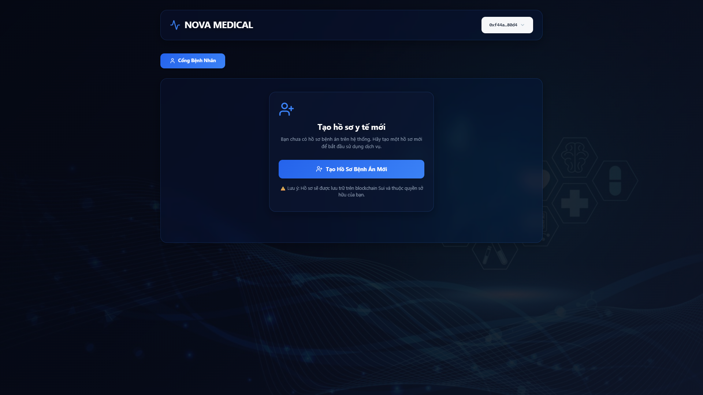
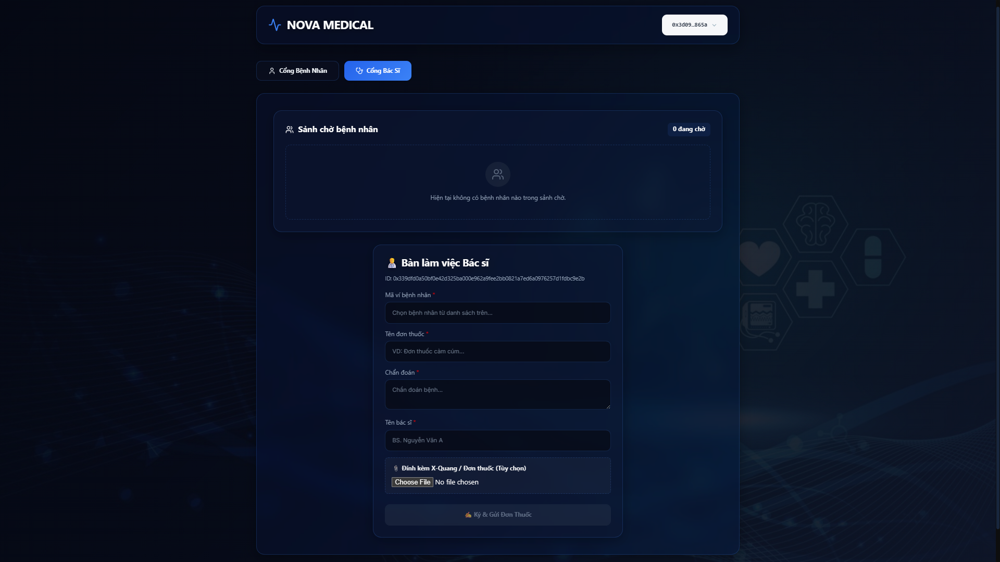

# 🏥 Sui Medical System MVP


-E4405F?style=for-the-badge&logo=ipfs)

> **Decentralized Healthcare Platform on Sui Network** > Transparent medical records, secure doctor-patient interactions, and immutable prescription history.

---

## 📸 Screenshots

| Patient Portal | Doctor Dashboard |
|:---:|:---:|
|  |  |

## 🌟 Introduction

**Sui Medical System** is a Web3 application designed to solve the lack of transparency and data synchronization in traditional healthcare. By leveraging the **Sui Blockchain**, we ensure that:
* **Medical Records** are owned by patients, not hospitals.
* **Prescriptions** are immutable and verifiable.
* **Doctors** are verified via on-chain governance (NFT Capabilities).

This project was built as an MVP (Minimum Viable Product) for a Hackathon, demonstrating the speed and object-centric model of Sui Move.

## 🚀 Key Features

### 👨‍⚕️ For Doctors
* **Verified Access:** Only doctors holding a `DoctorCap` (NFT) can access the dashboard.
* **Smart Lobby:** Real-time view of waiting patients with priority sorting.
* **Digital Prescriptions:** Issue prescriptions with diagnosis and medications.
* **IPFS Integration:** Upload X-Rays/Medical images directly to decentralized storage.

### 👤 For Patients
* **Medical Profile:** Create a unique medical record on-chain.
* **Register for Exam:** Join the hospital lobby with symptoms and priority level.
* **History:** View all past prescriptions and diagnoses transparently.

### 🛡️ For Admins
* **Governance:** Mint and grant `DoctorCap` to verified medical professionals.

---

## 🔗 Live Demo

Experience the dApp live on Sui Testnet:
👉 **[https://sui-medical-system-project.vercel.app/](https://sui-medical-system-project.vercel.app/)**

*(Note: Please switch your wallet to **Sui Testnet**)*

---

## 🛠️ Tech Stack

* **Smart Contract:** Sui Move (Object-centric model).
* **Frontend:** React (TypeScript) + Vite.
* **Wallet Integration:** `@mysten/dapp-kit` (Supports Sui Wallet, Slush, etc.).
* **Storage:** Pinata (IPFS) for off-chain medical data (images).
* **Deployment:** Vercel.

---

## 💻 Getting Started (Local Development)

Follow these steps to run the project on your machine.

### Prerequisites
* [Node.js](https://nodejs.org/) (v18+)
* [Sui CLI](https://docs.sui.io/guides/developer/getting-started/sui-install) (for smart contract)
* A Sui Wallet extension (Sui Wallet / Slush)

### 1. Clone the Repository
```bash
git clone https://github.com/Bryan1805a/SUI_medical_system_project.git
cd SUI_medical_system_project
```

### 2. Install Frontend Dependencies
Navigate to the frontend folder (e.g., web_frontend or client): 
```bash
cd web_frontend\medical-app
npm install
```

### 3. Configure Environment
Create or update src/config.ts with your Contract IDs (or use the provided default ones):
```bash
// src/config.ts
export const PACKAGE_ID = "0x..."; // Your deployed Package ID
export const ADMIN_CAP_ID = "0x..."; // Your AdminCap ID
export const LOBBY_ID = "0x..."; // Your Shared Lobby ID
export const PINATA_JWT = "YOUR_PINATA_KEY"; // Optional for upload feature
```

### 4. Run the dApp
```bash
npm run dev
```

Open http://localhost:5173 in your browser.

---

## 📦 Smart Contract Deployment (Optional)
If you want to deploy your own version of the contract:
### 1. Navigate to the Move folder:
```bash
cd sui_contracts\medical_system
```

### 2. Publish to Testnet:
```bash
sui client publish --gas-budget 100000000
```

### 3. Copy the new Package ID, Lobby ID, and AdminCap ID into src/config.ts.

---

🗺️ Roadmap & Future Improvements
To make this project production-ready, we plan to implement:

[ ] Data Structure Optimization: Migrate from Vector to LinkedTable to prevent race conditions in the lobby.

[ ] Privacy: Implement End-to-End Encryption for sensitive medical data before IPFS upload.

[ ] Anti-Spam: Add a "Stake-to-Consult" mechanism (SUI deposit) to prevent lobby spamming.

---

🤝 Contributing
Contributions are welcome! Please feel free to submit a Pull Request.
